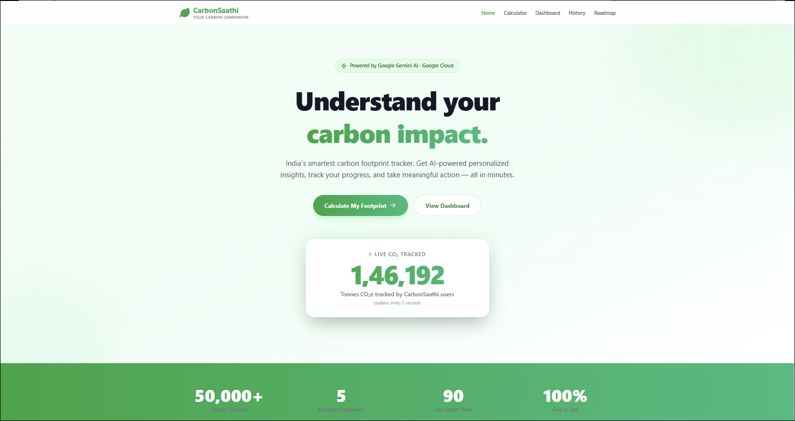
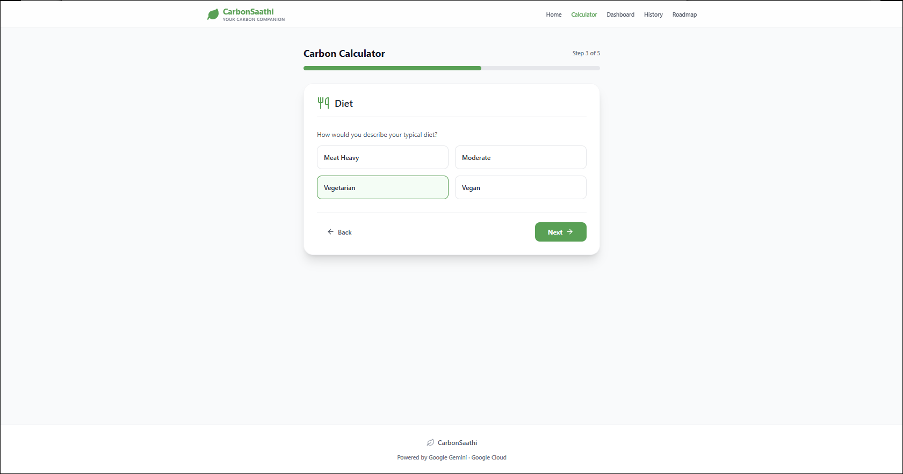
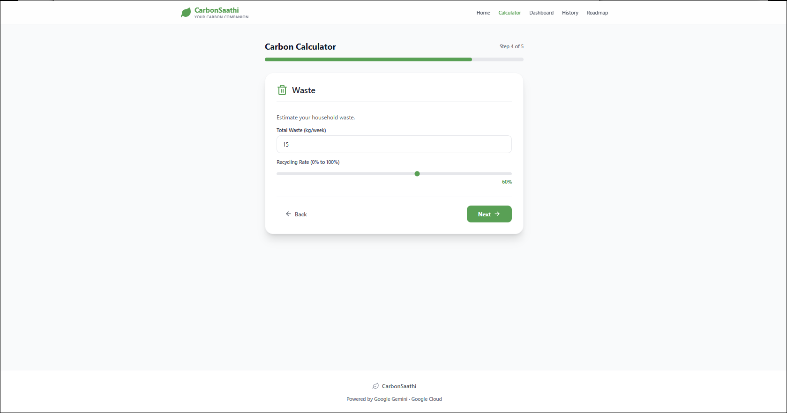
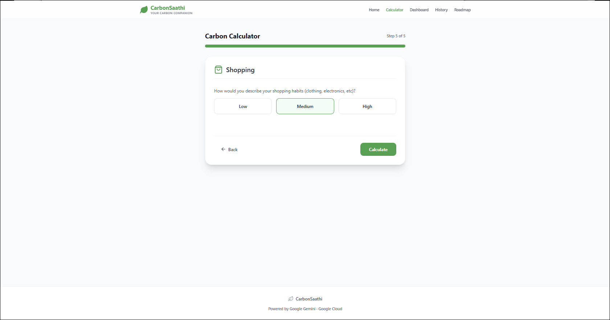
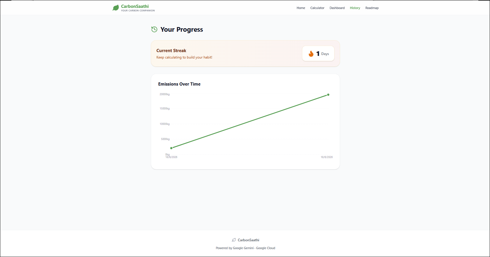
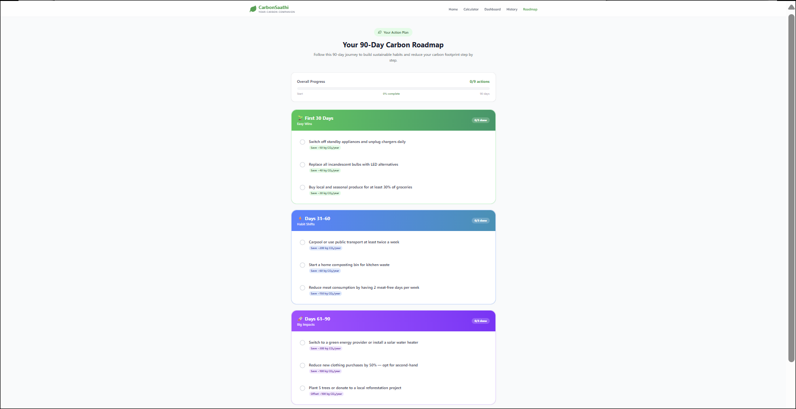

# 🌱 CarbonSaathi — Your Carbon Companion

> Submitted for PromptWars Virtual Challenge 3 by Hack2Skill × Google for Developers  
> Built with Google Antigravity IDE

**🔗 Live Demo:** https://carbon-footprint-sadiya.web.app  
**📂 GitHub:** https://github.com/Sadiya0505/carbon-footprint-platform

---

## 🎯 Problem Statement
Carbon Footprint Awareness Platform — Design a solution that helps individuals understand, track, and reduce their carbon footprint through simple actions and personalized insights.

---

## 💡 My Solution — CarbonSaathi

CarbonSaathi is a production-grade web application that helps Indians:
**Understand → Track → Reduce** their personal carbon footprint using India-specific science-backed metrics and Google Gemini AI-powered insights.

**The gap I solved:** Most carbon calculators use Western emission factors and give generic advice. CarbonSaathi uses Indian grid data, local transport factors, and generates truly personalized AI recommendations.

---

## ✨ Features

| Feature | Description |
|---------|-------------|
| 5-Step Calculator | Transport, Home Energy, Diet, Waste & Shopping |
| India-Specific Factors | Indian electricity grid (0.82 kg/kWh), LPG cylinders, local transport |
| Carbon Grade (A–F) | Instant score based on annual footprint |
| AI Insights | Personalized tips by Google Gemini 2.5 Flash |
| AI Roadmap | Gemini-generated personalized 90-day action plan |
| Progress Tracking | History charts + daily streaks |
| Global Benchmarks | vs India avg (1.9t), Global (4.7t), Paris target (2.0t) |
| Shareable Result Card | Downloadable PNG for LinkedIn/Instagram |
| Fun Carbon Facts | Shown between calculator steps |
| WCAG Accessible | Keyboard navigable, screen reader friendly |

---

## 🛠️ Tech Stack

### Frontend
- React 18 + TypeScript + Vite
- Tailwind CSS
- Zustand (state management)
- Recharts (data visualization)
- Framer Motion (animations)
- React Router DOM

### AI & Cloud Services
- **Google Gemini 2.5 Flash** — AI insights + roadmap generation
- **Firebase Firestore** — Anonymous history storage by device ID
- **Firebase Hosting** — Live deployment + CDN
- **Google Cloud** — Project infrastructure

---

## 🌍 India-Specific Emission Factors

| Category | Factor | Source |
|----------|--------|--------|
| Electricity | 0.82 kg CO₂e/kWh | CEA India Grid 2023 |
| LPG Cylinder | 42.5 kg CO₂e per 14.2kg | IPCC AR6 |
| Petrol Car | 0.15 kg CO₂e/km | MoRTH India |
| Diesel Car | 0.17 kg CO₂e/km | MoRTH India |
| Diet (meat-heavy) | 2.5 kg CO₂e/day | Our World in Data |
| Diet (vegetarian) | 1.0 kg CO₂e/day | Our World in Data |

---

## 🧠 Prompt Engineering Highlights

- **Structured JSON output** — Gemini prompted to return strict JSON schema for roadmap
- **Context-aware** — AI focuses on user's top 2 highest emission categories
- **Encouraging tone** — Prompts tuned for positive, actionable Indian context
- **Fallback handling** — Default plan shown if Gemini API unavailable
- **Regenerate button** — Users can request fresh AI insights anytime

---

## 🔒 Privacy & Security

- Zero PII collected — no login required
- Anonymous tracking via session-scoped device IDs
- API keys stored in environment variables only
- Firebase security rules enforce read/write controls

---

## 🚀 Run Locally

```bash
git clone https://github.com/Sadiya0505/carbon-footprint-platform
cd carbon-footprint-platform
npm install
cp .env.example .env
# Add your VITE_GEMINI_API_KEY to .env
npm run dev
```

---

## 📸 App Screenshots

### Home Page


### Calculator






### Results Dashboard
![Results](screenshots/dashboard.png

### History


### 90-Day Roadmap


---

*Powered by Google Gemini · Google Cloud*  
*Built with Google Antigravity IDE*
