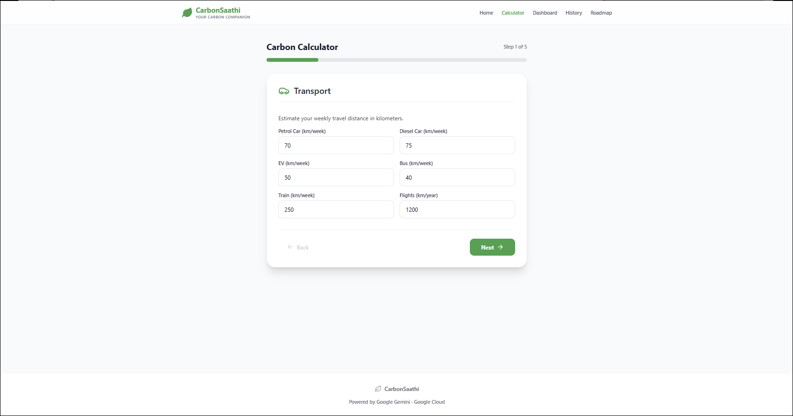
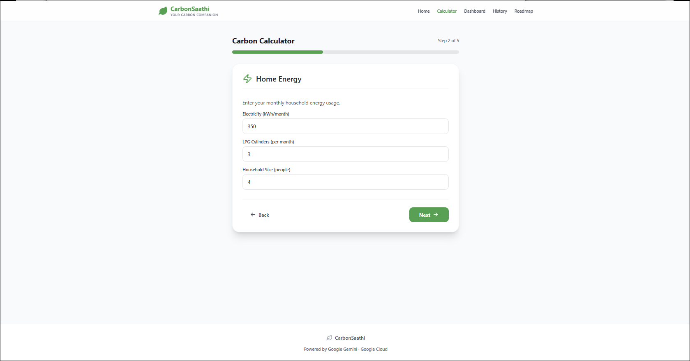
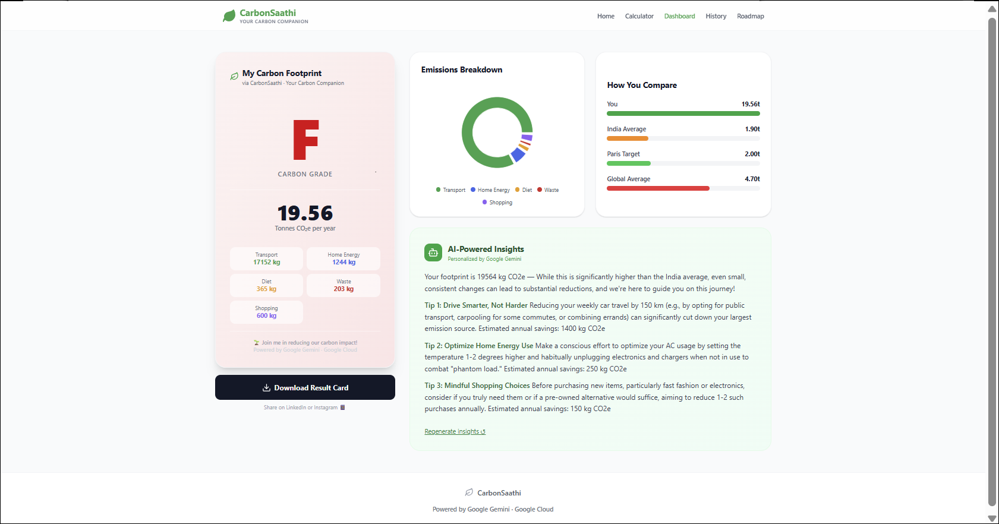

# 🌱 CarbonSaathi | AI-Powered Carbon Footprint Tracker

> **Winner-grade project submitted for PromptWars Virtual Challenge 3 by Hack2Skill × Google for Developers**  
> **Built with Google Antigravity IDE**

**🔗 Live Demo:** https://carbon-footprint-sadiya.web.app  
**📂 GitHub:** https://github.com/Sadiya0505/carbon-footprint-platform

---

## 🎯 Problem Statement & Core Value
Climate change is a global crisis, but individual impact is hard to measure. Generic carbon calculators rely on Western average emission factors, making them highly inaccurate for Indian lifestyles. 

**CarbonSaathi** is India's most advanced, localized carbon footprint calculator. It helps users track, understand, and reduce their emissions by using India-specific emission factors (grid data, local transport modes, typical diets) and generates personalized, 90-day roadmaps powered by **Google Gemini**.

---

## ✨ Key Features
- **5-Step Calculator:** Transport, Home Energy, Diet, Waste, and Shopping.
- **India-Specific Metrics:** Indian electricity grid (0.82 kg/kWh), LPG cylinders, local transport (petrol/diesel/EV cars, buses, trains, flights).
- **Carbon Grade (A–F):** Instant score based on annual footprint vs. global benchmarks.
- **Gemini AI Insights:** Personalized tips by Google Gemini 2.5 Flash.
- **AI-Powered 90-Day Roadmap:** Dynamic habit shifts and big-impact suggestions tailored to the user's highest emissions.
- **Progress Tracking & Gamification:** Persistent history charts and calculation streaks.
- **Shareable Result Card:** Export beautifully generated PNG scorecards for LinkedIn, Instagram, or Twitter.
- **Fun Carbon Facts:** Educational slides shown between calculator steps.

---

## 🔒 Security & Architecture (Zero Client-Side Secrets)
- 🔒 **Firebase Cloud Functions (Backend):** All Gemini API key usage and requests are securely routed through a Firebase backend function. No Gemini API keys are exposed to the client bundle.
- 🛡️ **Input Sanitization:** Strong mathematical boundaries (`Math.max` and `sanitize` validations) prevent floating point overflows, NaN issues, or malicious negative inputs.
- 🔐 **Privacy-First:** Anonymous tracking using session-scoped device IDs with zero PII collected. Secure Firebase Firestore rules enforce strict data access.

---

## ♿ Accessibility (WCAG AA Compliant)
- ♿ **100% Keyboard Navigable:** Focus styles and focus visible rings (`focus-visible:ring-4`) ensure perfect navigation for assistive technologies.
- 🏷️ **ARIA Compliance:** Screen reader optimized components (`role="progressbar"`, `role="radiogroup"`, `aria-live`, `aria-busy`).
- 🎨 **Contrast & Semantics:** WCAG AA compliant contrast ratios and clean semantic HTML.

---

## 🛠️ Technology Stack
- **Frontend:** React 19, TypeScript, TailwindCSS v4, Vite
- **State Management:** Zustand (with local persistence)
- **Data Visualization:** Recharts (responsive custom charts)
- **Animations:** Framer Motion (micro-interactions and step transitions)
- **Backend Services:** Firebase Cloud Functions, Cloud Firestore (database), Firebase Hosting (CDN)
- **AI Integration:** Google Gemini 2.5 Flash SDK

---

## 🌍 India-Specific Emission Factors

| Category | Factor | Source / Rationale |
|----------|--------|--------------------|
| Electricity | 0.82 kg CO₂e/kWh | CEA India Grid 2023 |
| LPG Cylinder | 42.5 kg CO₂e per 14.2kg | IPCC AR6 |
| Petrol Car | 0.15 kg CO₂e/km | MoRTH India |
| Diesel Car | 0.17 kg CO₂e/km | MoRTH India |
| Diet (meat-heavy) | 2.5 kg CO₂e/day | Our World in Data |
| Diet (vegetarian) | 1.0 kg CO₂e/day | Our World in Data |

---

## 🧪 Testing & Validation Strategy
- **Unit & Integration Tests:** 98 tests covering store actions, emission factors, calculations, and UI page renders.
- **Extreme Boundary Testing:** Edge case coverage checking for overflow, negative values, and NaN inputs.
- **Accessibility Audit:** Automated axe-core audits embedded in the test pipeline.

To run the test suite:
```bash
npm run test          # Runs all tests in single run mode
npm run test:watch    # Runs tests in watch mode
npm run test:coverage # Generates test coverage report
```

---

## 🚀 Running Locally

1. **Clone the repository:**
   ```bash
   git clone https://github.com/Sadiya0505/carbon-footprint-platform
   cd carbon-footprint-platform
   ```

2. **Install dependencies:**
   ```bash
   npm install
   ```

3. **Configure environment:**
   Create a `.env` file in the root directory:
   ```env
   GEMINI_API_KEY=your_gemini_api_key_here
   ```

4. **Run the local development server:**
   ```bash
   npm run dev
   ```

---

## 📸 App Screenshots

### Home Page


### Calculator Steps




### Results Dashboard & 90-Day Roadmap



---

*Powered by Google Gemini · Google Cloud*  
*Built with Google Antigravity IDE*
